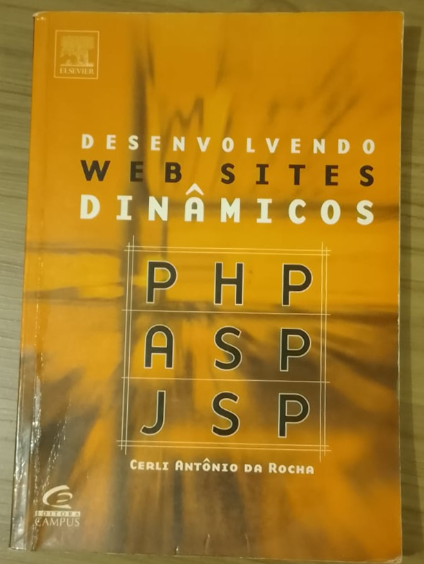
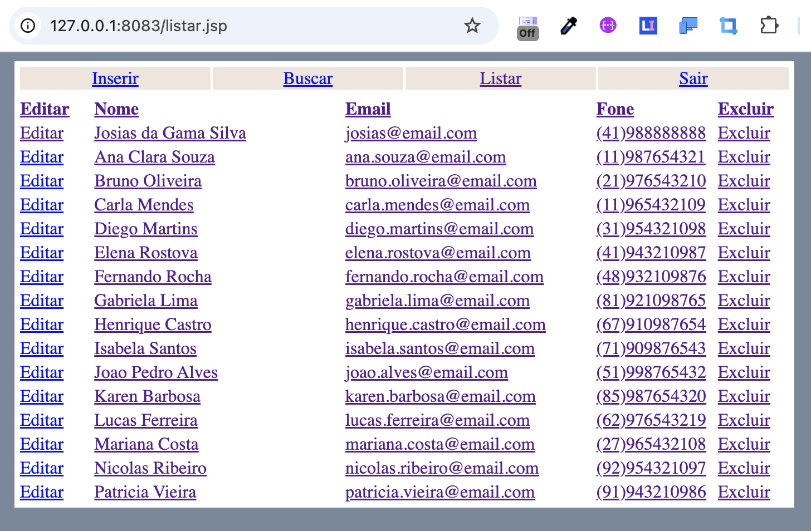

# Agenda — PHP, ASP e JSP

Aplicação do livro **PHP–ASP–JSP: Desenvolvendo Websites Dinâmicos**, de Cerli Antônio da Rocha, remasterizada para Docker, utilizando banco de dados Microsoft Access.



## Website legado do autor do livro: 
https://web.archive.org/web/20090721115122/http://www.naredemundial.com.br/livro/ 

### Material de Origem / PDF do Livro
O arquivo [`websites_dinamicos_php_asp_jsp.pdf`](websites_dinamicos_php_asp_jsp.pdf) presente no repositório é a cópia exata disponibilizada originalmente pelo próprio autor (Cerli Antônio da Rocha) em seu site oficial (recuperada através do Internet Archive: [Download original no Web Archive](https://web.archive.org/web/20090612070253/http://www.naredemundial.com.br/livro/downloads/websites_dinamicos_php_asp_jsp.pdf)). Esse documento serviu como referência primária para a transcrição e remasterização dos códigos em PHP, ASP e JSP.

## Demonstração da Aplicação



- `php/`: transcrição da versão do livro, com algumas correções.
- `asp/`: transcrição da versão do livro, com algumas correções.
- `jsp/`: transcrição da versão do livro, com algumas correções.
- `originais/`: transcrição da versão do livro.
- `infra/`: arquivos de configuração do Docker, serviço Java de acesso ao MDB e documentação.
- `infra/database/agenda.mdb`: banco local, ignorado pelo Git.

```sh
cd infra
docker compose up -d --build
```

Acesse PHP em http://localhost:8081/index.php, ASP em http://localhost:8082/index.asp
e JSP em http://localhost:8083/index.jsp. Login e senha: `agenda`.

Veja [infra/README.md](infra/README.md) para versões, arquitetura, criação do banco
e diferenças em relação aos PDFs e aos códigos originais.

## Comparação entre a aplicação `php/` e `originais/php/`

### 1. O Problema de Arquitetura (Por que foi necessária a mudança?)
- **No original (`originais/php/`)**: A aplicação dependia da função nativa `odbc_connect()` do PHP rodando em ambiente Windows, conectando-se a um DSN ODBC configurado no Windows para o arquivo Microsoft Access (`agenda.mdb`).
- **No Docker (Linux com PHP 4.4.9)**: O Linux rodando em container Docker não possui o driver ODBC do MS Access. A infraestrutura do projeto utiliza um serviço Java no container `jsp` (porta 8081) que abre o arquivo `.mdb` via UCanAccess/JDBC e expõe uma API HTTP/XML interna para os comandos do banco.

### 2. O que precisou ser modificado em `php/funcoes.php`
Para não alterar o código das telas de 2003, criamos uma camada de compatibilidade ODBC em `php/funcoes.php`:
- **Emulação das funções nativas de ODBC**: Implementamos em PHP puro as funções `odbc_connect`, `odbc_exec`, `odbc_fetch_row` e `odbc_result`.
- **Tradução de SQL para HTTP/XML**:
  - A função `odbc_exec` analisa a query SQL recebida (`SELECT`, `INSERT`, `UPDATE`, `DELETE`).
  - Ela faz uma chamada HTTP POST via socket para a API do container `jsp:8081/agenda`.
  - Converte a resposta XML do banco em uma estrutura de dados compatível com `odbc_fetch_row` e `odbc_result`.

### 3. O que mudou nas páginas (`listar.php`, `editar.php`, `search.php`, etc.)
O código das telas permaneceu 99% idêntico ao original do livro de 2003.

Todas as páginas continuam utilizando exatamente as mesmas funções: `conecta()`, `odbc_exec()`, `odbc_fetch_row()` e `odbc_result()`.

As únicas alterações nas telas foram:
- **Tratamento de Notices do PHP**: Ajuste na checagem da conexão de `if (!$con)` para `if (empty($con))` e inicialização global de `$con = null;` para evitar mensagens de variável não definida no PHP.
- **Correção de erro de digitação do livro**: Em `listar.php`, corrigido o atributo `<a ref="...">` da transcrição original do livro para `<a href="...">`.

### Resumo

| Arquivo / Componente | O que mudou em relação ao original | Motivo |
| --- | --- | --- |
| `php/funcoes.php` | Adicionada a ponte/emulador ODBC para a API HTTP (`jsp:8081`). | Permitir acesso ao Access (`.mdb`) no Linux/Docker sem driver ODBC nativo. |
| Páginas (`listar.php`, etc.) | Estrutura 100% preservada. Apenas ajustes pontuais de Notice e correção da tag `href`. | Manter a fidelidade total às listagens do livro de 2003. |

## Comparação entre a aplicação `asp/` e `originais/asp/`

### 1. O Problema de Arquitetura (Por que foi necessária a mudança?)
- **No original (`originais/asp/`)**: A aplicação dependia dos drivers ODBC e ADODB nativos do Windows (`Server.CreateObject("ADODB.Connection")` e `con.Open "DSN=AGENDA;UID=agenda;PWD=agenda"`), conectando-se a um DSN ODBC configurado no Windows para o arquivo Microsoft Access (`agenda.mdb`).
- **No Docker (Linux com AxonASP Server)**: O runtime AxonASP rodando no Linux não possui o driver ODBC do MS Access. Tentar conectar via DSN resulta no erro `ADODB.Connection: unsupported connection string`. A infraestrutura do projeto utiliza um serviço Java no container `jsp` (porta 8081) que abre o arquivo `.mdb` via UCanAccess/JDBC e expõe uma API HTTP/XML interna para os comandos do banco.

### 2. O que precisou ser modificado em `asp/funcoes.asp`
Para não alterar a sintaxe e o fluxo de chamadas das telas de 2003, criamos uma camada de compatibilidade do ADODB em VBScript em `asp/funcoes.asp`:
- **Emulação dos Objetos ADODB**: Implementamos em VBScript as classes `DbConnection` e `Recordset`.
- **Tradução de SQL para HTTP/XML**:
  - `DbConnection.Execute` e `Recordset.Open` interceptam as instruções SQL (`SELECT`, `INSERT`, `UPDATE`, `DELETE`).
  - Utilizam o objeto `MSXML2.ServerXMLHTTP` nativo do AxonASP para enviar requisições HTTP POST à API do container `jsp:8081/agenda`.
  - Utilizam o objeto `MSXML2.DOMDocument` para processar a resposta XML e fornecer a interface esperada pelas páginas (`.EOF`, `.MoveNext`, `.Close` e o iterador de colunas `rs("CAMPO")` ou `rs(0)`).

### 3. O que mudou nas páginas (`listar.asp`, `editar.asp`, `detalhes.asp`, etc.)
- **Substituição de Instanciação do Recordset**: Nas páginas de consulta (`listar.asp`, `editar.asp`, `detalhes.asp`, `search.asp`, `buscar.asp`), a chamada `Server.CreateObject("ADODB.Recordset")` foi substituída por `Set rs = New Recordset` para utilizar a classe de emulação.
- **Correção de Caracteres Especiais e Aspas Inteligentes**: Substituição de aspas curvas/inteligentes (`‘`) por aspas simples normais (`'`) no cabeçalho dos arquivos VBScript para evitar erros de compilação do AxonASP (`'800A0408' Invalid character`).
- **Concatenação de Strings Multilinha**: Ajuste na sintaxe de strings multilinha do VBScript em consultas SQL e comandos JavaScript para evitar erros de runtime (`'800A0409' Unterminated string constant`).

### Resumo

| Arquivo / Componente | O que mudou em relação ao original | Motivo |
| --- | --- | --- |
| `asp/funcoes.asp` | Adicionadas as classes `DbConnection` e `Recordset` em VBScript puro usando `MSXML2.ServerXMLHTTP` e `MSXML2.DOMDocument`. | Permitir acesso ao Access (`.mdb`) no Linux/AxonASP via API HTTP sem driver ODBC nativo. |
| Páginas (`asp/*.asp`) | Substituição de `Server.CreateObject("ADODB.Recordset")` por `New Recordset`, remoção de aspas curvas (`‘`) e ajuste de strings multilinha. | Manter a compatibilidade com o parser VBScript do AxonASP Server mantendo o fluxo original do livro. |

## Comparação entre a aplicação `jsp/` e `originais/jsp/`

### 1. O Problema de Arquitetura (Por que foi necessária a mudança?)
- **No original (`originais/jsp/`)**: A aplicação tentava utilizar o driver de ponte ODBC histórico da Sun (`sun.jdbc.odbc.JdbcOdbcDriver` com `DriverManager.getConnection("jdbc:odbc:Agenda")`), conectando-se a um DSN ODBC configurado no Windows para o arquivo Microsoft Access (`agenda.mdb`).
- **No Docker (Linux com OpenJDK 17 + Tomcat 9)**: O driver `sun.jdbc.odbc.JdbcOdbcDriver` foi descontinuado e removido do Java a partir do Java 8 (2014). Para permitir a manipulação direta do arquivo `.mdb` do Access sem o MS Office ou ODBC, a aplicação utiliza a biblioteca **UCanAccess** (driver JDBC baseado em Jackcess) executada no container `jsp`.

### 2. O que precisou ser modificado em `infra/java/` e `jsp/funcoes.jsp`
Para preservar os métodos JDBC nativos (`createStatement()`, `execute()`, `executeUpdate()`, `getResultSet()`) usados em todo o código de 2003:
- **Compartilhamento da Conexão UCanAccess com Proxy**: Adicionado o método `getJspConnection()` na classe `Store.java` (`infra/java/src/main/java/agenda/Store.java`), que fornece a conexão JDBC única do UCanAccess envelopada por um `java.lang.reflect.Proxy`. Esse proxy ignora chamadas `.close()` feitas individualmente pelas páginas JSP, evitando que a conexão global com o banco seja encerrada.
- **Obtenção da Conexão em `jsp/funcoes.jsp`**: Substituída a tentativa de carregar o driver ODBC legado pela chamada `agenda.Main.store.getJspConnection()`.

### 3. O que mudou nas páginas (`index.jsp`, `listar.jsp`, `inserir_agenda.jsp`, etc.)
- **Correção do Loop de Redirecionamento em `index.jsp`**: No original, a branch `else` (quando o usuário não estava logado) fazia `response.sendRedirect("index.jsp")`, gerando um loop infinito 302 que impedia o acesso ao site pelo navegador. O arquivo foi ajustado para renderizar a tela de login (`login.jsp`).
- **Correção de Sintaxe de Strings Multilinha**: O compilador Jasper do Tomcat 9 exige que literals de String em blocos de código Java não contenham quebras de linha manuais sem concatenação (`+`). Ajustadas as strings de consulta SQL em `listar.jsp`, `inserir_agenda.jsp`, `editar.jsp`, `detalhes.jsp`, `atualizar_agenda.jsp` e `search.jsp`.
- **Ajustes de Comentários de Cabeçalho**: Adicionada a marcação de abertura de comentário `/*` após `<%! ` em `listar.jsp` para evitar falha no parser Java.

### Resumo

| Arquivo / Componente | O que mudou em relação ao original | Motivo |
| --- | --- | --- |
| `infra/java/src/main/java/agenda/Store.java` e `jsp/funcoes.jsp` | Adicionado `getJspConnection()` com Proxy para interceptar `.close()` e atualizada a conexão de `jdbc:odbc:` para o UCanAccess. | Permitir acesso JDBC nativo ao Access no Java 17 / Tomcat 9 mantendo a conexão global ativa. |
| `jsp/index.jsp` | Substituído o formulário duplicado e o `sendRedirect("index.jsp")` pelo formulário de Login. | Eliminar o loop infinito 302 de redirecionamento quando não logado. |
| Páginas (`jsp/*.jsp`) | Unificação de strings SQL multilinhas e correção da tag de comentário em `listar.jsp`. | Garantir a compilação limpa do código Java pelo Tomcat Jasper. |

## Menções Honrosas e Agradecimentos

Este projeto foi tornado possível graças a projetos open-source e ferramentas essenciais que viabilizaram a execução das três aplicações legadas de 2003 dentro de um ambiente conteinerizado moderno em Linux:

- **[Cerli Antônio da Rocha](https://web.archive.org/web/20090721115122/http://www.naredemundial.com.br/livro/)**: Autor do livro original *PHP–ASP–JSP: Desenvolvendo Websites Dinâmicos*, pela disponibilização do material didático e exemplos práticos.
- **[AxonASP Server](https://github.com/guimaraeslucas/axonasp)** (por [Lucas Guimarães](https://github.com/guimaraeslucas)): Menção honrosa especial a este servidor e runtime de alta performance escrito em Go que possibilita a execução nativa de aplicações em ASP Clássico (VBScript) em ambiente Linux/Docker.
- **[UCanAccess](https://spannm.github.io/ucanaccess/)** (por Marco Amadei): Driver JDBC 100% Java que permite leitura, escrita e manipulação completa de bancos Microsoft Access (`.mdb` / `.accdb`) no Linux sem dependência do MS Office ou de drivers ODBC do Windows.
- **[Jackcess](https://jackcess.sourceforge.io/)**: Biblioteca Java para manipulação do formato MS Access que serve como motor base para o UCanAccess.
- **[Apache Tomcat](https://tomcat.apache.org/)**: Servidor web e container de Servlets/JSP para execução da versão JSP em Java 17.
